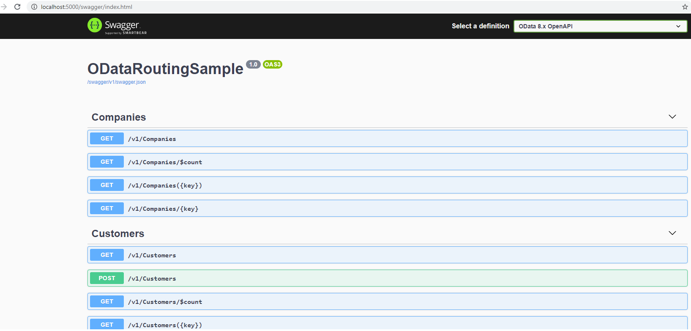

# ASP.NET Core OData (8.x) Sample

---
This is an ASP.NET Core OData 8.x sample project. From this sample, you can see a lot of ASP.NET Core OData 8.x usage.


## Static Routing table

If you run the sample and send the following request in a Web brower:

`~/$odata`, you will get the following (similar) routing table:


## OpenAPI/Swagger

If you run the sample and send the following request in a Web brower:

`/swagger`, you will get the following (similar) swagger page:



## Non-Edm model

Non-Edm model means there's no "Edm Model" configed for a route.
For example: the following routing doesn't have the Edm model associated.

```C#
~/api/Accounts
~/api/Accounts/{id}
```

Here's a sample:
`http://localhost:5000/api/accounts?$select=Name&$top=3`

you can get:
```json
[
    {
        "Name": "Warm"
    },
    {
        "Name": "Scorching"
    },
    {
        "Name": "Sweltering"
    }
]
```

Known issue: It seems there are some issues related to the complex property selection.

* `http://localhost:5000/api/accounts?$select=HomeAddress`

* `http://localhost:5000/api/accounts?$select=HomeAddress($select=City)`

## Raw OpenAPI/Swagger

If you run the sample and send the following request in a Web brower:

`/v1/$openapi`, you will get the following (similar) swagger page:

```json
{
  "openapi": "3.0.1",
  "info": {
    "title": "OData Service for namespace Default",
    "description": "This OData service is located at http://localhost:5000/v1",
    "version": "1.0.1"
  },
  "servers": [
    {
      "url": "http://localhost:5000/v1"
    }
  ],
  "paths": {
    "/Companies": {
      "get": {
        "tags": [
          "Companies.Company"
        ],
        "summary": "Get entities from Companies",
        "operationId": "Companies.Company.ListCompany",
        "parameters": [
          {
            "$ref": "#/components/parameters/top"
          },
          {
            "$ref": "#/components/parameters/skip"
          },

          
```

You can use `$format=application/{yaml|json};version={2.0|3.0}` to get openApi in different format and version.
